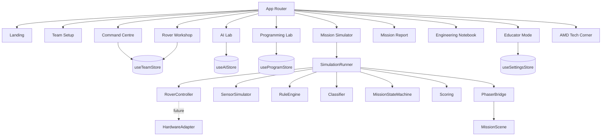

# AMD AI Rover Challenge — Implementation Plan (First Deliverable)

> **Status:** Approved architecture, implementation in progress.
> **Working title:** AMD AI Rover Challenge: Sense, Think, Move
> **Audience:** Singapore secondary students, ~13–16.

---

## 1. Repository Assessment

The workspace `c:\git\self_projects\amd_robotics` was **empty** at the time of assessment.

| Check | Result |
| --- | --- |
| Existing framework | None |
| Existing dependencies | None |
| Existing source files | None |
| Git history | Not initialised |
| Node toolchain | Node v25.6.0, npm 11.8.0 available |

**Conclusion:** greenfield project. No existing code to preserve, so the recommended stack
(React + TypeScript + Vite + Phaser 3) is adopted without compromise.

---

## 2. Technical Architecture

Four strictly separated layers. Data flows downward; events flow upward.

```
┌────────────────────────────────────────────────────────────────┐
│ PRESENTATION  React 19 + TypeScript + modular CSS design system │
│ Screens, HUD, rule builder, AI lab, notebook, educator console  │
└───────────────┬────────────────────────────────────────────────┘
                │ Zustand stores (plain objects only)
┌───────────────▼────────────────────────────────────────────────┐
│ DOMAIN  Pure TypeScript. No React. No Phaser. No DOM.           │
│ rover control · sensors · rules engine · AI classifier ·        │
│ mission state machine · scoring · badges · RNG                  │
└───────────────┬────────────────────────────────────────────────┘
                │ RoverController interface (shared contract)
┌───────────────▼─────────────────┬──────────────────────────────┐
│ SIMULATION (MVP)                │ HARDWARE (future phase)      │
│ Deterministic tick engine       │ HardwareAdapter impls:       │
│ + Phaser 3 renderer             │ WebSerial / WebBluetooth /   │
│                                 │ Python bridge                │
└─────────────────────────────────┴──────────────────────────────┘
┌────────────────────────────────────────────────────────────────┐
│ PERSISTENCE  LocalStorage (versioned, corruption-tolerant)      │
│ CONTENT      JSON missions + datasets, schema-validated         │
└────────────────────────────────────────────────────────────────┘
```

### Key architectural rules

1. **Phaser never reads React state.** React pushes a `WorldSnapshot` into Phaser via an
   imperative bridge; Phaser emits render-only output. The authoritative simulation runs in
   plain TypeScript (`src/game/engine/`), so the game is fully testable in Node with no canvas.
2. **The AI model is swappable.** `Classifier` is an interface. MVP ships a deterministic
   pure-JS multinomial logistic-regression classifier (fast, no downloads, no WebGL). A
   TensorFlow.js implementation can be dropped in behind the same interface later.
3. **Missions are data, not code.** Every mission is a JSON file validated against a schema.
   Adding a mission requires no TypeScript changes.
4. **Determinism first.** All randomness goes through a seeded PRNG (mulberry32). Same seed +
   same program + same model ⇒ identical run. This is what makes workshops reliable and
   replays possible.

---

## 3. Component Diagram



---

## 4. Game-State Design

Five Zustand stores, each independently persisted to LocalStorage under a versioned key.

| Store | Owns | Persisted |
| --- | --- | --- |
| `useTeamStore` | team profile, mission progress, badges, scores, notebook | ✅ |
| `useRoverStore` | rover build, budget spend, component loadout | ✅ |
| `useAIStore` | training samples, model weights, metrics, confidence policy | ✅ |
| `useProgramStore` | rule list per mission, program validation state | ✅ |
| `useSettingsStore` | accessibility, educator mode, workshop safe mode, branding | ✅ |

Transient simulation state (rover pose, tick, event log) lives **outside** React in
`SimulationRunner` and is surfaced to the HUD through a throttled subscription. This prevents
per-frame React re-renders.

### Mission lifecycle state machine

```
briefing → configuring → ready → running ⇄ paused
                                    ↓
                            succeeded | failed → report → (retry | next)
```

---

## 5. Core TypeScript Interfaces

Defined in `src/types/`. Summary of the contract set:

```ts
interface Prediction { label: LabelId; confidence: number; scores: Record<LabelId, number>; timestamp: number; }
interface SensorReading { sensorId: string; type: SensorType; value: number | string | boolean; timestamp: number; }
interface Rule { id: string; enabled: boolean; priority: number; condition: Condition; action: Action; }
interface Mission { id: string; title: string; story: string; map: MissionMap; objectives: MissionObjective[]; scoring: ScoringWeights; /* … */ }
interface MissionResult { missionId: string; success: boolean; score: MissionScore; telemetry: RunTelemetry; explanations: string[]; }
interface HardwareAdapter { connect(): Promise<void>; disconnect(): Promise<void>; sendCommand(c: RoverCommand): Promise<void>; readSensors(): Promise<SensorReading[]>; isConnected(): boolean; }
```

Full definitions ship in the repository; see `docs/architecture.md`.

---

## 6. Mission Data Schema

Missions are JSON in `public/missions/`, indexed by `public/missions/index.json`, and validated
at load time by a hand-written validator (`src/missions/validateMission.ts`) that returns
student-friendly errors. Grid maps use a legend of single characters:

| Char | Meaning |
| --- | --- |
| `.` | road / drivable |
| `#` | building / wall |
| `~` | flood water (hazard) |
| `!` | debris hazard zone |
| `S` | supply station |
| `T` | target (person / important item) |
| `B` | base / command centre |
| `o` | obstacle (movable debris) |
| `g` | greenery (slow, costs energy) |

---

## 7. Proposed Folder Structure

```
src/
  app/            router, layout, error boundary
  components/     shared UI primitives (Button, Card, Panel, Gauge, Modal, Tooltip…)
  screens/        one folder per game screen
  game/
    engine/       deterministic simulation core (pure TS)
    scenes/       Phaser scenes
    entities/     rover + world entity models
    systems/      sensors, energy, collision, scoring
    phaser/       React↔Phaser bridge
  ai/
    classifier/   pure-JS logistic regression + interface
    datasets/     deterministic sample generation
    metrics/      accuracy, confusion matrix, balance analysis
  robotics/
    control/      RoverController interface + SimulatedController
    adapters/     HardwareAdapter interface + stubs
  missions/       loader, validator, registry
  program/        rule types, evaluation, JSON codec, pseudocode view
  educator/       educator-mode helpers, export
  notebook/       notebook entry builders + exporters
  store/          zustand stores + persistence middleware
  hooks/  utils/  types/  styles/  content/
public/
  missions/  datasets/  branding/
docs/
tests/  unit/ integration/ e2e/
```

---

## 8. UI Screen Map

```
Landing ──▶ Team Setup ──▶ Command Centre ─┬─▶ Rover Workshop
   │                             ▲          ├─▶ AI Lab
   ├─▶ Educator Mode ────────────┘          ├─▶ Programming Lab
   ├─▶ Settings                             ├─▶ Engineering Notebook
   └─▶ Credits                              ├─▶ AMD Technology Corner
                                            └─▶ Mission Simulator ─▶ Mission Report
```

---

## 9. MVP Scope

**In scope (build now)**

- All 10 screens, navigable and functional.
- Deterministic simulation with rover, sensors, obstacles, hazards, supplies, targets, base,
  energy, collisions, timer, step-through, speed control, debug overlay.
- Phaser top-down renderer with Singapore-inspired original tile art (drawn procedurally).
- Visual rule builder producing JSON, plus read-only pseudocode view.
- AI Lab with deterministic dataset generation, labelling, training with live progress,
  accuracy, confusion matrix, per-class counts, imbalance warnings, misclassification review,
  Instant Training Mode, and prediction→action wiring.
- Confidence-threshold policy (act / verify / stop) affecting gameplay and score.
- 5 missions in JSON + scoring out of 100 across 7 categories + 8 badges.
- Engineering notebook with auto-entries, student reflections, JSON/Markdown/HTML export.
- Educator Mode + Workshop Safe Mode + session export.
- Accessibility: keyboard nav, focus states, high contrast, colour-blind palette,
  text scaling, reduced motion, icon+text labels.
- Unit/integration tests (Vitest) and one Playwright end-to-end mission run.

**Out of scope (deliberately deferred)**

- Physical hardware I/O (interfaces + stubs only).
- TensorFlow.js (interface-compatible slot reserved).
- Real image classification (feature vectors + rendered visual patterns instead).
- Online leaderboards, accounts, backend, analytics.

---

## 10. Risks and Mitigations

| # | Risk | Impact | Mitigation |
| --- | --- | --- | --- |
| R1 | Browser ML training is slow/flaky on school laptops | Workshop stalls | Pure-JS classifier, no WebGL/downloads; Instant Training Mode; model persists locally |
| R2 | Phaser fails to init (old GPU, blocked WebGL) | Game unplayable | `Phaser.AUTO` → Canvas fallback; simulation is headless-authoritative so a text HUD still works; error boundary with friendly message |
| R3 | Non-deterministic runs confuse students/graders | Unfair scoring | Seeded PRNG everywhere; fixed-timestep loop; seed shown in report |
| R4 | Student program loops forever | Frozen tab | Hard tick cap, stall detector, cycle guard in rule engine |
| R5 | Corrupt LocalStorage | Blank/broken app | Versioned schema, try/catch parse, auto-reset with notice, manual "clear data" |
| R6 | Scope overrun | Nothing demoable | Vertical slice first (Mission 1 end-to-end) then breadth |
| R7 | Too much reading for teens | Disengagement | Max ~40 words per briefing card, tooltips over paragraphs, feedback in the sim |
| R8 | AMD/brand asset licensing | Legal | Logo *slots* only, configurable via JSON; simulated performance data clearly labelled |
| R9 | Offline classroom | Load failure | No CDN or runtime fetch of third-party assets; all content bundled/served locally |

---

## 11. Milestone Plan

| Milestone | Content | Exit criteria |
| --- | --- | --- |
| **M1 Foundation** | Vite+React+TS+Phaser, design system, router, stores, persistence, branding config | App boots, all routes reachable, progress survives reload |
| **M2 Simulator** | Map render, rover, movement, collision, distance sensor, run/pause/reset, Missions 1–2 | Mission 1 & 2 completable |
| **M3 Programming** | Rule builder, validation, execution, step-through | Student rules change rover behaviour |
| **M4 AI Lab** | Dataset, labelling, training, metrics, imbalance, predictions→rules | AI prediction drives rover |
| **M5 Full loop** | Missions 3–5, scoring, reports, badges, notebook | Full 5-mission campaign with reports |
| **M6 Educator** | Educator console, safe mode, exports, presentation mode, troubleshooting | Educator can run a session end-to-end |
| **M7 Polish** | A11y, responsive, errors, tests, docs, deploy config | Tests pass, docs complete, deployable build |

---

## 12. Assumptions

1. Target browsers: current Chrome/Edge (school standard). Firefox/Safari best-effort.
2. Single-device team play; "team" is a local profile, not networked multiplayer.
3. "Leaderboard" = local score history on the device / exported for cross-team comparison.
4. No official AMD artwork is available, so branding is placeholder slots driven by
   `public/branding/branding.json`.
5. Educator Mode is a local toggle with no authentication (explicitly requested).
6. Singapore setting is conveyed with original procedural art, no real landmarks or emblems.
7. Simulated compute comparisons are illustrative teaching aids, labelled as such, and use no
   real AMD product benchmark numbers.
8. English-only UI for the MVP; copy is written in simple English suitable for Secondary 1–4.
